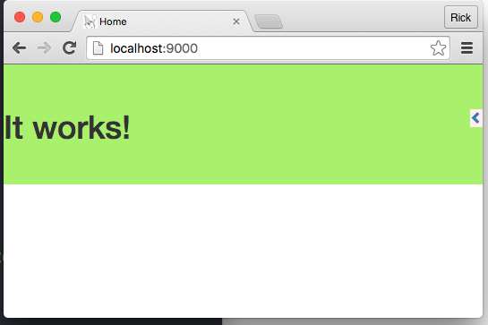

# Introduction
A development container is just what it sounds like, a container designed to facilitate make it easy for developers to write code with a specific framework. A well designed development container will remove any concern about installing the framework and tools, managing associated infrastructure such as databases, or pretty much anything that will distract the developer from actually writing code. Additionally, it will assume that the developer is creating micro-services and immutable infrastucture.

A good development container will work "out of the box." This entails creating and running a default project if necessary, or simply running a project if it is already present.

# Create a Repository
We are going to use Stacksmith to generate the base Dockerfile that we will use. This is important because Bitnami actively maintains their base images. If we use Stacksmith to generate the Dockerfile, Bitnami will automatically send us a pull request if their base image gets updated for any reason. In this way we stay up to date, and even automate it.

I created a repository called "revel-dev-container". Now it is a simple matter of filling in the form in Stacksmtih. Luckily, Bitnami has a base image all set up for Go development.

# Create the Dockerfile
##What Stacksmith Provides
You don't need to sign into Bitnami to use Stacksmith. But you do need to be logged in to use the Github integration. So, make sure you have an account and are signed in.


After clicking "Create stack" I can go to github repro and see that there is a pull request from Stacksmith. It is asking to add a Dockerfile, which is of course what I want. So I merge the pull request. And then pull it. Now I have a Dockerfile locally, that looks like this:

```
## BUILDING
##   (from project root directory)
##   $ docker build -t rickspencer3-revel-dev-container .
##
## RUNNING
##   $ docker run rickspencer3-revel-dev-container

FROM gcr.io/stacksmith-images/debian-buildpack:wheezy-r07

MAINTAINER Bitnami <containers@bitnami.com>

ENV STACKSMITH_STACK_ID="l51eq4k" \
    STACKSMITH_STACK_NAME="rickspencer3/revel-dev-container" \
    STACKSMITH_STACK_PRIVATE="1"

RUN bitnami-pkg install go-1.6.2-0 --checksum 79b828a23b7582197799e775d65501b082d71d589ba6eed7aa3d68cf75b94a19

ENV GOPATH=/gopath
ENV PATH=$GOPATH/bin:/opt/bitnami/go/bin:$PATH

## STACKSMITH-END: Modifications below this line will be unchanged when regenerating

# Go base template
COPY . /app
WORKDIR /app

```

The important line is this:

```
## STACKSMITH-END: Modifications below this line will be unchanged when regenerating
```

If we do all of our work in the container below that line, then Stacksmith can make a pull request by changing only what is above that line. This will allow me to automate testing and other cool things when Stacksmith has an update.

## Build the Container
Let's start out by building the container from the Dockerfile just to make sure it all works well. I like to tag the images when I build them to make them easier to run, so:

```
$ docker build -t revel .
```
Of course since it is unmodified, it builds perfectly fine. Let's take a look inside, though. Note that I am mounting a local directory called "app". The reason for this will be clear later. The fact that the container will be used in development of immutable infrastructure should be an early clue, though.

```
$ docker run -it -v /Users/rick/revel-dev-container/app:/app revel /bin/bash

        _____
 ______/_____\_______
/                    \
!    Bitnami         !
!      Stacksmith    !
\____________________/
         {\ }
         { \}
         L_ }
        / _)}
       / /__L
 _____/ (____)  Welcome to your rickspencer3/revel-dev-container container!
        (____)  Go to https://stacksmith.bitnami.com/dashboard/stacks/l51eq4k
 _____  (____)  to manage your stack.
      \_(____)  
         {\ }
         { \}
         \__/

root@65d461fd2182:/app#
```
I know the container will need use git to install revel, so let's make sure that git is installed.

```
root@2e980047b8de:/app# git --version
git version 1.7.10.4
```

## Add Revel to the container
This container will extend the default Go container by installing Revel. Instructions for installing Revel are available at the [Revel Github Page](https://revel.github.io/).

We do this using go get. Simply add this command to Dockerfile directly after the "STACKSMITH-END" part. Revel needs to build inside $GOPATH. Because we want the code to always be mounted externally (remember, the container is immutable) we can add the app directory to GOPATH in the container as well.

```
RUN go get github.com/revel/cmd/revel
ENV GOPATH=$GOPATH:/app
```

##Manually test Revel
Now we can build and run the container again, and ensure that the revel commands work.

```
$ docker build -t revel .
$ docker run -it -v /Users/rick/revel-dev-container/app:/app revel /bin/bash
# revel new github.com/rickspencer3/bitnami-app
~
~ revel! http://revel.github.io
~
Your application is ready:
   /app/src/github.com/rickspencer3/bitnami-app

You can run it with:
   revel run github.com/rickspencer3/bitnami-app
   root@30e411634363:/app# revel run github.com/rickspencer3/bitnami-app
   ~
   ~ revel! http://revel.github.io
   ~
   INFO  2016/07/08 09:44:36 revel.go:365: Loaded module static
   INFO  2016/07/08 09:44:36 revel.go:365: Loaded module testrunner
   INFO  2016/07/08 09:44:36 revel.go:230: Initialized Revel v0.13.1 (2016-06-06) for >= go1.4
   INFO  2016/07/08 09:44:36 run.go:57: Running bitnami-app (github.com/rickspencer3/bitnami-app) in dev mode
   INFO  2016/07/08 09:44:36 harness.go:170: Listening on :9000

```
Since the container is immutable and I mounted the app directory from a local volume, we can see that the generated code was saved locally if I exit the container and look on my local directory.

```
# exit
exit
$ ls app/
src
```

# Override the Entry Point
Now that we have an image that installs Revel and sets up GOPATH properly, we can go ahead and add a little logic to the image. We want the image to behave differently depedning on:

1. Is there already source code in the /app directory? If not, then generate the code.
2. Let the developer pass in their github user name and a name for the application to create and/or run that application. This is done via environment variables.

##Create and override the entrypoint.sh file
I am going to start by looking at an [existing entrypoint.sh file](https://github.com/bitnami/bitnami-docker-laravel/blob/master/rootfs/app-entrypoint.sh).

That is much more complete that we need, but there are some useful bits for me to copy out of there. First, I will go ahead and call 2 of the embedded entrypoint.sh functions that come with the base container. Then, I will execute the command to create the app, and finally I will tell tiny to run the app. I will start with place holder names.

```
#!/bin/bash

#call useful embedded functions
source /opt/bitnami/stacksmith-utils.sh
print_welcome_page
check_for_updates &

#create the app
revel new github.com/githubuser/myapp

#run the app
revel run github.com/githubuser/myapp
```

revel-entrypoint.sh is a logical name for this. We need to add it to our docker file and override the existing entrypoint.

```
COPY ./revel-entrypoint.sh /
ENTRYPOINT ["/revel-entrypoint.sh"]
```

##Test the New Entry Point
After I build the image again, I will run it, but I will use a slightly different command to run it non-interactively.

```
docker run -d -v /Users/rick/revel-dev-container/app:/app revel
```

After running it this way, I can look at the logs to see what the container is doing:

```
$ docker ps
CONTAINER ID        IMAGE               COMMAND                  CREATED             STATUS              PORTS               NAMES
e9dedbd420b1        revel               "/revel-entrypoint.sh"   5 seconds ago       Up 4 seconds                            determined_shannon
Ricks-MacBook-Pro:revel-dev-container rick$ docker logs e9dedbd420b1

        _____
 ______/_____\_______
/                    \
!    Bitnami         !
!      Stacksmith    !
\____________________/
         {\ }
         { \}
         L_ }
        / _)}
       / /__L
 _____/ (____)  Welcome to your rickspencer3/revel-dev-container container!
        (____)  Go to https://stacksmith.bitnami.com/dashboard/stacks/n7dnqby
 _____  (____)  to manage your stack.
      \_(____)  
         {\ }
         { \}
         \__/

~
~ revel! http://revel.github.io
~
Abort: Import path github.com/githubuser/myapp already exists.
~
~ revel! http://revel.github.io
~
INFO  2016/07/08 10:32:22 revel.go:365: Loaded module static
INFO  2016/07/08 10:32:22 revel.go:365: Loaded module testrunner
INFO  2016/07/08 10:32:22 revel.go:230: Initialized Revel v0.13.1 (2016-06-06) for >= go1.4
INFO  2016/07/08 10:32:22 run.go:57: Running myapp (github.com/githubuser/myapp) in dev mode
INFO  2016/07/08 10:32:22 harness.go:170: Listening on :9000
Ricks-MacBook-Pro:revel-dev-container rick$
```

##Expose the Port
Clearly the app is running. However, I won't be able ot look at it because I didn't open any ports in Dockerfile, so I will add that to the docker file:

```
EXPOSE 9000
```

Then I can map that port when I run the container:

```
$ docker run -d -p 9000:9000 -v /Users/rick/revel-dev-container/app:/app revel
```

Now I can look at it in the browser:


##Skip Generating the App if it is Already there
By adding some simple bash logic, we can generate the app code only if it already exists:

```
if [ ! -d "/app/src/" ]; then
  echo -e  "Creating Revel App"
  revel new github.com/githubuser/myapp
else
  echo -e "App found, reusing"
fi
```

##Parameterize the App Creation and Use
Lastly, we can setup the entry point to use environment variables to allow the developer to specify their github username and the name for their app. If the developer does not pass in a github user id, we will simply create the app.

The whole revel-entrypoint.sh file looks like this:

```
#!/bin/bash

#call useful embedded functions
source /opt/bitnami/stacksmith-utils.sh
print_welcome_page
check_for_updates &

#set app name to ENV or default
AP="my-app"

if [ "$APP_NAME" != "" ]; then
    AP=$APP_NAME
fi

#set path to github user or default
P=""
if [ "$GITHUB_USER" != "" ]; then
  P="github.com/$GITHUB_USER/$AP"
else
  P="$AP"
fi

echo "Using $P for application path"

#create the app if necessary
if [ ! -d "/app/src/" ]; then
  echo -e  "Creating Revel App"
  revel new $P
else
  echo -e "App found, reusing"
fi

#run the app
revel run $P
```

And if we use the environment variables, we can control how the app is created:

```
docker run --name revel -d -p 9000:9000 -v /Users/rick/revel-dev-container/app:/app -e GITHUB_USER='rickspencer3' -e APP_NAME='ricksapp' revel
ddc56599dc36d019fa9e7453cdc8ee7157175b658f10c8295b5dc0a16776293f
Ricks-MacBook-Pro:revel-dev-container rick$ docker logs revel

        _____
 ______/_____\_______
/                    \
!    Bitnami         !
!      Stacksmith    !
\____________________/
         {\ }
         { \}
         L_ }
        / _)}
       / /__L
 _____/ (____)  Welcome to your rickspencer3/revel-dev-container container!
        (____)  Go to https://stacksmith.bitnami.com/dashboard/stacks/n7dnqby
 _____  (____)  to manage your stack.
      \_(____)  
         {\ }
         { \}
         \__/

github.com/rickspencer3/ricksapp
Creating Revel App
~
~ revel! http://revel.github.io
~
Your application is ready:
   /app/src/github.com/rickspencer3/ricksapp

You can run it with:
   revel run github.com/rickspencer3/ricksapp
~
~ revel! http://revel.github.io
~
INFO  2016/07/08 13:33:16 revel.go:365: Loaded module testrunner
INFO  2016/07/08 13:33:16 revel.go:365: Loaded module static
INFO  2016/07/08 13:33:16 revel.go:230: Initialized Revel v0.13.1 (2016-06-06) for >= go1.4
INFO  2016/07/08 13:33:16 run.go:57: Running ricksapp (github.com/rickspencer3/ricksapp) in dev mode
INFO  2016/07/08 13:33:16 harness.go:170: Listening on :9000
```


# Create the docker-compose.yml file
The purpose of the docker-compose file is twofold:
1. It simplifies things for the developer, as it provides an easy place for them to edit and persist settings, which can then be invoked with a single command.
2. It makes it easy to provide the developer with related infrascruture components, such as a database.

Looking at [another Bitnami project](https://github.com/bitnami/bitnami-docker-laravel/blob/master/docker-compose.yml) it was easy to find a docker-compose.yml file that only needed three small tweaks:
1. Adjust the default port to 9000.
2. Edit it to use the Revel container as well. Because I was using the --name switch when I was running the image, I can refer to it that way until I have the image posted.
3. Optionally, tell it use the local app/ subdirectory.

```
version: '2'

services:
  mariadb:
    image: bitnami/mariadb:10.1.14-r0
    environment:
      - MARIADB_USER=my_user
      - MARIADB_DATABASE=my_database
      - MARIADB_PASSWORD=my_password

  myapp:
    image: revel
    environment:
      - DB_HOST=mariadb
      - DB_USERNAME=my_user
      - DB_DATABASE=my_database
      - DB_PASSWORD=my_password
    depends_on:
      - mariadb
    ports:
      - 9000:9000
    volumes:
      - ./app:/app
```
With this file, it is a very simple matter for the developer to start the project.

```
$ docker-compose up
reveldevcontainer_mariadb_1 is up-to-date
Starting reveldevcontainer_myapp_1
Attaching to reveldevcontainer_mariadb_1, reveldevcontainer_myapp_1
...
myapp_1    | INFO  2016/07/08 14:05:14 revel.go:365: Loaded module static
myapp_1    | INFO  2016/07/08 14:05:14 revel.go:230: Initialized Revel v0.13.1 (2016-06-06) for >= go1.4
myapp_1    | INFO  2016/07/08 14:05:14 main.go:30: Running revel server

```
