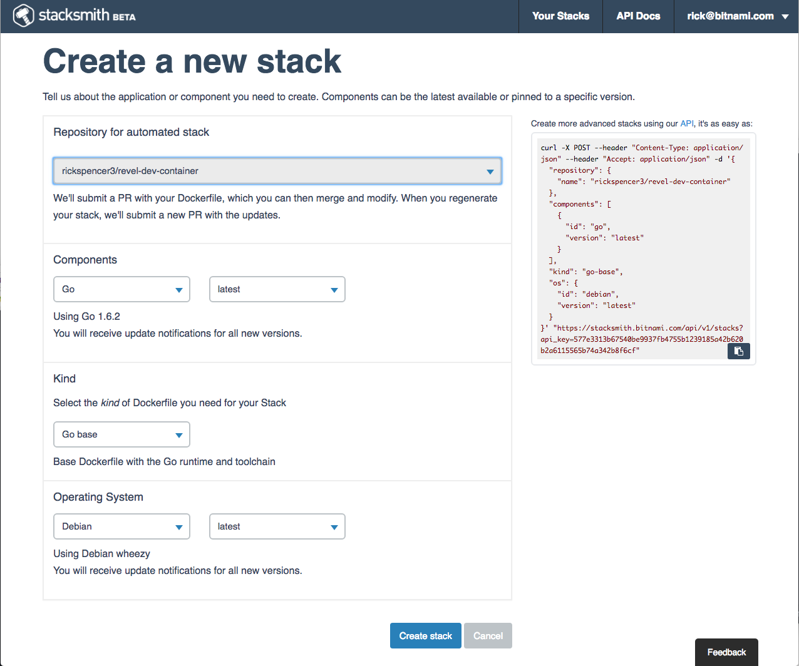

# Introduction
A development container is just what it sounds like, a container designed to facilitate make it easy for developers to write code with a specific framework. A well designed development container will remove any concern about installing the framework and tools, managing associated infrastructure such as databases, or pretty much anything that will distract the developer from actually writing code.

# Create a Repository
We are going to use Stacksmith to generate the base Dockerfile that we will use. This is important because Bitnami actively maintains their base images. If we use Stacksmith to generate the Dockerfile, Bitnami will automatically send us a pull request if their base image gets updated for any reason. In this way we stay up to date, and even automate it.

I created a repository called "revel-dev-container". Now it is a simple matter of filling in the form in Stacksmtih. Luckily, Bitnami has a base image all set up for Go development.

# Create the Dockerfile
You don't need to sign into Bitnami to use Stacksmith. But you do need to be logged in to use the Github integration. So, make sure you have an account and are signed in.

# Build the Container

# Create the docker-compose.yml file

# Add content to the container

# Override the Entry Point

#
